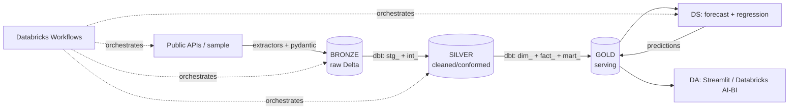

# 🌬️ AirHealth — Air Quality & Respiratory Health Analytics Platform

An end-to-end **Data Engineering → Data Science → Data Analysis** portfolio project
on **Databricks**. It links **air quality + weather + demographics** to
**respiratory-health outcomes** across US metros, using the **medallion
architecture** (bronze → silver → gold) on Delta Lake + Unity Catalog.

## What this demonstrates

| Discipline | In this project |
|---|---|
| **Data Engineering** | Multi-source ingestion w/ retries + schema validation, **medallion architecture (bronze → silver → gold)** in dbt on Delta + Unity Catalog, tests + docs, **Databricks Workflows** orchestration (Asset Bundle), GitHub Actions CI |
| **Data Science** | Reads the **gold** layer: PM2.5 time-series forecasting (gradient boosting vs. persistence baseline) + county asthma-prevalence regression (cross-validated, interpretable), MLflow tracking, predictions written back to gold |
| **Data Analysis** | Reads the **gold** layer: Streamlit dashboard on Databricks SQL (trends, AQI mix, weather↔AQ, health cross-section, model results), findings narrative, Databricks AI-BI recipe |

## Architecture



**Bronze → Silver → Gold.** Ingestion lands raw data in **bronze**; dbt cleans and
conforms it in **silver**; the **gold** star schema is the single contract that
both **DS** and **DA** read from (and DS writes predictions back into gold).

See [`docs/architecture.md`](docs/architecture.md) for the data dictionary and the
explicit DS/DA gold-consumption contract.

## Quickstart (Databricks)

```bash
pip install -r requirements.txt
cp .env.example .env          # set DATABRICKS_HOST / HTTP_PATH / TOKEN

# 1) one-time: create catalog + medallion schemas + bronze volume
#    run databricks/notebooks/00_setup.py in the workspace
# 2) deploy + run the end-to-end Workflow (ingest → load → dbt → train)
databricks bundle deploy -t dev
databricks bundle run airhealth_pipeline -t dev
# 3) the dashboard (connects to Databricks SQL)
make dashboard
```

Prefer notebooks? Run `databricks/notebooks/` in order:
`00_setup` → `01_ingest` → `02_load_warehouse` → dbt `build --target databricks`
→ `03_train_models`. Full guide: [`docs/databricks.md`](docs/databricks.md).

> **Ingestion runs anywhere.** `python -m ingestion.run_ingest` (sample mode)
> produces the parquet landing zone with no cloud account — that's what CI checks.
> The warehouse, dbt transforms and models run on Databricks.

## Live data instead of synthetic

Set `INGEST_MODE=api` (and provide `OPENAQ_API_KEY` / `CENSUS_API_KEY`) to pull from
[OpenAQ](https://openaq.org), [Open-Meteo](https://open-meteo.com),
[CDC PLACES](https://www.cdc.gov/places/) and the [Census ACS](https://www.census.gov/data/developers.html).

## Repo layout

```
ingestion/      extractors + shared http/io/schema/sample layer + bronze loader
dbt/            models/silver (stg_+int_) + models/gold (dim_+fact_+mart_), tests, macros, seeds
ds/             forecasting + regression models (read/write gold), MLflow, runner
dashboard/      Streamlit app (Databricks SQL)
databricks/     notebooks (00_setup → 01_ingest → 02_load → 03_train)
databricks.yml  Databricks Asset Bundle (Workflow job)
docs/           architecture + data dictionary + findings + databricks guide
tests/          unit tests
```

## Results (sample data)

- **PM2.5 forecast**: beats the persistence baseline (~18% MAE reduction on hold-out).
- **Asthma regression**: cross-validated R² ≈ 0.65; PM2.5 and income-deprivation are the
  strongest drivers — see [`docs/findings.md`](docs/findings.md).
