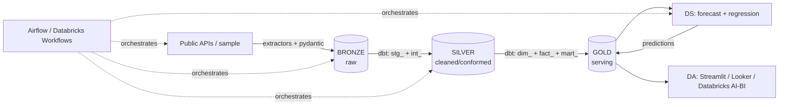

# 🌬️ AirHealth — Air Quality & Respiratory Health Analytics Platform

An end-to-end **Data Engineering → Data Science → Data Analysis** portfolio project.
It links **air quality + weather + demographics** to **respiratory-health outcomes**
across US metros, demonstrating a full modern-data-stack pipeline.

> **Runs anywhere with one command** — defaults to offline synthetic data + a local
> DuckDB warehouse, so reviewers need **no cloud account and no API keys**. The same
> code targets **GCP (BigQuery + GCS + Cloud Composer)** or **Databricks (Delta +
> Unity Catalog + Workflows + MLflow)** by flipping the `BACKEND` env var.

## What this demonstrates

| Discipline | In this project |
|---|---|
| **Data Engineering** | Multi-source ingestion w/ retries + schema validation, **medallion architecture (bronze → silver → gold)** in dbt, DuckDB/BigQuery/Databricks warehouse, tests + docs, **Airflow / Databricks Workflows** orchestration, **Terraform** IaC, Docker, GitHub Actions CI |
| **Data Science** | Reads the **gold** layer: PM2.5 time-series forecasting (gradient boosting vs. persistence baseline) + county asthma-prevalence regression (cross-validated, interpretable), MLflow tracking, predictions written back to gold |
| **Data Analysis** | Reads the **gold** layer: Streamlit dashboard (trends, AQI mix, weather↔AQ, health cross-section, model results), findings narrative, Looker Studio / Databricks AI-BI recipes |

## Architecture



**Bronze → Silver → Gold.** Ingestion lands raw data in **bronze**; dbt cleans and
conforms it in **silver**; the **gold** star schema is the single contract that
both **DS** and **DA** read from (and DS writes predictions back into gold).

See [`docs/architecture.md`](docs/architecture.md) for the data dictionary and layer-by-layer detail.

## Quickstart (local, ~1 minute)

```bash
python -m venv .venv && source .venv/bin/activate
pip install -r requirements.txt
cp .env.example .env

make run-local      # ingest → load → dbt build (+ tests) → train models
make dashboard      # open http://localhost:8501
```

Or with Docker:

```bash
docker compose -f docker/docker-compose.yml up pipeline   # pipeline + dashboard on :8501
docker compose -f docker/docker-compose.yml up airflow    # Airflow UI on :8080
```

## Going to the cloud (GCP)

```bash
cd infra/terraform && terraform init && terraform apply -var project_id=YOUR_PROJECT
# then in .env: BACKEND=bigquery, set GCP_PROJECT / GCS_BUCKET / GOOGLE_APPLICATION_CREDENTIALS
pip install dbt-bigquery
make run-local      # same commands, now targeting BigQuery
# build the Looker Studio report on the analytics dataset (see docs/architecture.md)
```

## Running on Databricks

```bash
# BACKEND=databricks → Delta Lake + Unity Catalog, dbt-databricks, Workflows, MLflow
databricks bundle deploy -t dev      # deploys the airhealth_pipeline Workflow
databricks bundle run airhealth_pipeline -t dev
```

Or run the notebooks in `databricks/notebooks/` (`00_setup` → `01_ingest` →
`02_load_warehouse` → dbt → `03_train_models`). Full guide:
[`docs/databricks.md`](docs/databricks.md).

## Live data instead of synthetic

Set `INGEST_MODE=api` (and provide `OPENAQ_API_KEY` / `CENSUS_API_KEY`) to pull from
[OpenAQ](https://openaq.org), [Open-Meteo](https://open-meteo.com),
[CDC PLACES](https://www.cdc.gov/places/) and the [Census ACS](https://www.census.gov/data/developers.html).

## Repo layout

```
ingestion/      extractors + shared http/io/schema/sample layer + bronze loader
dbt/            models/silver (stg_+int_) + models/gold (dim_+fact_+mart_), tests, macros, seeds
ds/             forecasting + regression models (read/write gold), MLflow, runner
dashboard/      Streamlit app
orchestration/  Airflow DAG
databricks/     notebooks (00_setup → 01_ingest → 02_load → 03_train)
databricks.yml  Databricks Asset Bundle (Workflow job)
infra/          Terraform (GCS + BigQuery, optional Composer)
docker/         Dockerfile + docker-compose (pipeline + Airflow)
docs/           architecture + data dictionary + findings + databricks guide
tests/          unit tests
```

## Results (sample data)

- **PM2.5 forecast**: beats the persistence baseline (~18% MAE reduction on hold-out).
- **Asthma regression**: cross-validated R² ≈ 0.65; PM2.5 and income-deprivation are the
  strongest drivers — see [`docs/findings.md`](docs/findings.md).
